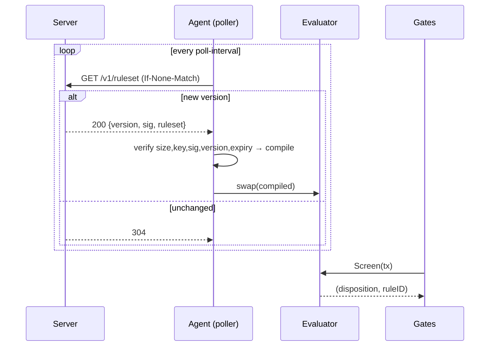

# Project Sentinel — Technical Design

**Status:** Draft

Sentinel is an optional, node-local threat-screening layer plus a centralized rules service. A node that opts in pulls signed rules from the Server and, for flagged transactions, declines to admit/gossip them and excludes them from blocks it proposes.

**Invariant:** the Agent acts only at CheckTx admission and PrepareProposal block-building. It never touches `ProcessProposal`, writes no consensus state, and never makes a block invalid.

---

## 1. Architecture

```
┌──────────── SENTINEL SERVER (off-chain) ─────────────┐
│ ingest → score → compile RuleSet → sign → /v1/ruleset │
└───────────────┬───────────────────────────────────────┘
                │ signed RuleSet (HTTPS pull, ETag)
                ▼
┌──────────── SENTINEL AGENT (in-process, optional) ────┐
│ poller → verify → compile → atomic swap → Evaluator    │
│                          ┌──────┴──────┐               │
│            Gate A (CheckTx)             Gate B (PrepareProposal)
│            reject / deprioritize        exclude from my block
└────────────────────────────────────────────────────────┘
```

| File (`app/sentinel/`) | Responsibility |
|---|---|
| `config.go` | `Config`, defaults, `app.toml` template, read from `appOpts` |
| `source.go` | poller: fetch → verify → compile → atomic swap |
| `verify.go` | envelope parsing, ed25519, version/expiry checks |
| `compile.go` | `RuleSet` → `compiledRuleSet` (sets → maps) + validation |
| `evaluator.go` | `Evaluator` (atomic ruleset), `Evaluate` / `Screen` |
| `view.go` | `BuildTxView` — extract fields once per tx |
| `match.go` | predicate-tree evaluation |
| `ante.go` | Gate A decorator |
| `agent.go` | lifecycle: `New`, `Start`, `Stop`, `Evaluator()` |

Integration: Gate A is appended to the ante `ExtraDecorators`; Gate B is composed into the `validateTx` passed to `NewExtTxSelector`. Both in `app/app.go`.

---

## 2. Rules

Distributed as a signed protobuf `RuleSet`; authored in YAML and compiled by the Server.

```proto
syntax = "proto3";
package cronos.sentinel.v1;

message RuleSet {
  uint64 version    = 1;             // strictly monotonic
  int64  issued_at  = 2;
  int64  expires_at = 3;
  map<string,string> price_snapshot = 4;  // denom -> USD
  repeated NamedSet sets  = 5;
  repeated Rule     rules = 6;
}
message NamedSet {
  string name = 1;
  enum Kind { ADDRESS = 0; SELECTOR = 1; DENOM = 2; }
  Kind kind = 2;
  repeated bytes values = 3;
}
message Rule { string id = 1; string description = 2; Match match = 3; Action action = 4; }
message Match { oneof node { Condition cond = 1; AllOf all = 2; AnyOf any = 3; Match not = 4; } }
message AllOf { repeated Match nodes = 1; }
message AnyOf { repeated Match nodes = 1; }
message Condition {
  enum Field { SENDER=0; RECIPIENT=1; CONTRACT=2; VALUE=3; CALLDATA_SELECTOR=4;
               CALLDATA=5; MSG_TYPE_URL=6; EIP7702_AUTHORITY=7; EIP7702_TARGET=8; TO_IS_CREATE=9; }
  enum Op { IN=0; EQ=1; GT=2; LT=3; CONTAINS=4; IS_TRUE=5; }
  Field  field = 1;
  Op     op    = 2;
  string set_ref     = 3;   // for IN
  bytes  bytes_value = 4;   // for EQ/CONTAINS
  string usd         = 5;   // for VALUE GT/LT
}
message Action {
  enum Disposition { ALLOW=0; DEPRIORITIZE=1; WITHHOLD=2; }
  Disposition disposition = 1;
  int64 floor_priority    = 2;
}
```

```yaml
version: 184
expires_at: 2026-06-19T00:00:00Z
price_snapshot: { "basetcro": "0.08", "ibc/USDC": "1.00" }
sets:
  - { name: bridge_contracts, kind: address,  values: ["0x…bridge","0x…gateway"] }
  - { name: fresh_wallets,    kind: address,  values: ["0x…"] }   # server-resolved
  - { name: erc20_transfers,  kind: selector, values: ["0xa9059cbb","0x23b872dd"] }
rules:
  - id: huge-bridge-outflow
    match: { allOf: [ {field: CONTRACT, op: IN, set_ref: bridge_contracts},
                      {field: VALUE,    op: GT, usd: "100000"} ] }
    action: { disposition: DEPRIORITIZE, floor_priority: -1000000 }
  - id: fresh-wallet-drain
    match:  { field: SENDER, op: IN, set_ref: fresh_wallets }
    action: { disposition: WITHHOLD }
  - id: erc20-transfer-into-flagged-token
    match: { allOf: [ {field: CALLDATA_SELECTOR, op: IN, set_ref: erc20_transfers},
                      {field: CONTRACT,          op: IN, set_ref: flagged_tokens} ] }
    action: { disposition: WITHHOLD }
```

Heavy signals (fresh wallets, velocity, unverified deployers) are resolved Server-side into `NamedSet`s; the Agent only does set membership, a 4-byte selector compare, and a value-vs-USD check.

---

## 3. Publishing & fetching

The Server publishes a signed JSON envelope wrapping the proto:

```json
{ "key_id":"2026-q2", "alg":"ed25519", "version":184,
  "issued_at":1718668800, "expires_at":1718755200,
  "ruleset_b64":"…", "sig_b64":"…" }
```

```go
// shared by server (sign) and agent (verify)
func SigningBytes(e *Envelope, rulesetBytes []byte) []byte {
    var b bytes.Buffer
    b.WriteString("cronos-sentinel/v1\x00")           // domain separator
    binary.Write(&b, binary.BigEndian, e.Version)
    binary.Write(&b, binary.BigEndian, e.IssuedAt)
    binary.Write(&b, binary.BigEndian, e.ExpiresAt)
    b.Write(rulesetBytes)
    return b.Bytes()
}
```

Serving is a static handler with `ETag = version`; `If-None-Match` yields `304`. The Agent fetches conditionally and caps the body size:

```go
func (s *Source) fetch(ctx context.Context) (env *Envelope, etag string, notModified bool, err error) {
    req, _ := http.NewRequestWithContext(ctx, http.MethodGet, s.cfg.RulesetEndpoint, nil)
    if s.etag != "" { req.Header.Set("If-None-Match", s.etag) }
    resp, err := s.client.Do(req)
    if err != nil { return nil, "", false, err }
    defer resp.Body.Close()

    switch resp.StatusCode {
    case http.StatusNotModified:
        return nil, s.etag, true, nil
    case http.StatusOK:
        body, err := io.ReadAll(io.LimitReader(resp.Body, s.cfg.MaxRulesetBytes+1))
        if err != nil { return nil, "", false, err }
        if int64(len(body)) > s.cfg.MaxRulesetBytes {
            return nil, "", false, fmt.Errorf("ruleset exceeds %d bytes", s.cfg.MaxRulesetBytes)
        }
        var e Envelope
        if err := json.Unmarshal(body, &e); err != nil { return nil, "", false, err }
        return &e, resp.Header.Get("ETag"), false, nil
    default:
        return nil, "", false, fmt.Errorf("status %d", resp.StatusCode)
    }
}
```

---

## 4. Refreshing

One background goroutine polls on a ticker; failures keep the last-good ruleset.

```go
type Source struct {
    cfg    Config
    keys   map[string]ed25519.PublicKey // key_id -> pubkey (pinned)
    client *http.Client
    eval   *Evaluator
    logger log.Logger
    etag   string
    quit   chan struct{}
    wg     sync.WaitGroup
}

func (s *Source) Start() { s.wg.Add(1); go s.loop() }
func (s *Source) Stop()  { close(s.quit); s.wg.Wait() }

func (s *Source) loop() {
    defer s.wg.Done()
    s.refresh()
    t := time.NewTicker(s.cfg.PollInterval); defer t.Stop()
    for {
        select {
        case <-s.quit: return
        case <-t.C:    s.refresh()
        }
    }
}

func (s *Source) refresh() {
    ctx, cancel := context.WithTimeout(context.Background(), s.cfg.RequestTimeout)
    defer cancel()
    env, etag, notModified, err := s.fetch(ctx)
    if err != nil { s.logger.Error("fetch failed, keeping last-good", "err", err); return }
    if notModified { return }
    compiled, err := s.verifyAndCompile(env)
    if err != nil { s.logger.Error("rejecting ruleset", "version", env.Version, "err", err); return }
    s.eval.swap(compiled)
    s.etag = etag
    telemetry.SetGauge(float32(compiled.version), "cronos", "sentinel", "ruleset_version")
}
```

Verification order (any failure rejects the payload, keeps last-good):

```go
func (s *Source) verifyAndCompile(e *Envelope) (*compiledRuleSet, error) {
    pub, ok := s.keys[e.KeyID]
    if !ok { return nil, fmt.Errorf("unknown key_id %q", e.KeyID) }
    rulesetBytes, err := base64.StdEncoding.DecodeString(e.RulesetB64); if err != nil { return nil, err }
    sig, err := base64.StdEncoding.DecodeString(e.SigB64);             if err != nil { return nil, err }
    if !ed25519.Verify(pub, SigningBytes(e, rulesetBytes), sig) { return nil, errors.New("bad signature") }
    if cur := s.eval.cur.Load(); cur != nil && e.Version <= cur.version {
        return nil, fmt.Errorf("stale version %d <= %d", e.Version, cur.version)
    }
    if time.Now().Unix() > e.ExpiresAt+int64(graceSeconds) { return nil, errors.New("expired") }
    var rs sentinelv1.RuleSet
    if err := proto.Unmarshal(rulesetBytes, &rs); err != nil { return nil, err }
    return compile(&rs)
}
```

The live ruleset is swapped atomically; the hot path reads it lock-free:

```go
type Evaluator struct {
    cur      atomic.Pointer[compiledRuleSet]
    failOpen bool
    signer   sdkmempool.SignerExtractionAdapter
}
func (e *Evaluator) swap(rs *compiledRuleSet) { e.cur.Store(rs) }
func (e *Evaluator) snapshot() *compiledRuleSet { return e.cur.Load() }
func (e *Evaluator) Screen(tx sdk.Tx) (Disposition, string) { return e.Evaluate(BuildTxView(tx, e.signer)) }
```

**Expiry:** `fail-open=true` (default) stops filtering once the live ruleset is past `expires_at`; `fail-open=false` keeps applying the last-good ruleset until a fresh one verifies. Version monotonicity resets on restart — `expires_at` bounds replay; persist last-seen version for stronger protection.

Compilation turns `NamedSet`s into maps and validates rules — a rule referencing a missing/wrong-kind set or an unsupported field·op rejects the whole ruleset rather than shipping as a silent no-op:

```go
type namedSet struct { kind sentinelv1.NamedSet_Kind; addrs map[[20]byte]struct{}; sels map[[4]byte]struct{}; denoms map[string]struct{} }
type compiledRuleSet struct {
    version uint64; expiresAt time.Time
    priceUSD map[string]*big.Rat; decimals map[string]uint32
    sets map[string]*namedSet; rules []*sentinelv1.Rule
}

func validateCond(cond *sentinelv1.Condition, c *compiledRuleSet) error {
    needSet := func(want sentinelv1.NamedSet_Kind) error {
        s, ok := c.sets[cond.SetRef]
        if !ok { return fmt.Errorf("unknown set_ref %q", cond.SetRef) }
        if s.kind != want { return fmt.Errorf("set %q kind mismatch", cond.SetRef) }
        return nil
    }
    switch cond.Field {
    case sentinelv1.Condition_SENDER, sentinelv1.Condition_RECIPIENT, sentinelv1.Condition_CONTRACT,
        sentinelv1.Condition_EIP7702_AUTHORITY, sentinelv1.Condition_EIP7702_TARGET:
        return needSet(sentinelv1.NamedSet_ADDRESS)
    case sentinelv1.Condition_CALLDATA_SELECTOR:
        return needSet(sentinelv1.NamedSet_SELECTOR)
    case sentinelv1.Condition_CALLDATA:
        if cond.Op != sentinelv1.Condition_CONTAINS || len(cond.BytesValue) == 0 { return errors.New("CALLDATA needs CONTAINS+bytes") }
    case sentinelv1.Condition_VALUE:
        if _, ok := new(big.Rat).SetString(cond.Usd); !ok { return errors.New("VALUE needs numeric usd") }
    case sentinelv1.Condition_TO_IS_CREATE:
    case sentinelv1.Condition_MSG_TYPE_URL:
        if len(cond.BytesValue) == 0 { return errors.New("MSG_TYPE_URL needs bytes_value") }
    default:
        return fmt.Errorf("unsupported field %v", cond.Field)
    }
    return nil
}
```

---

## 5. Applying rules

### Normalize once

```go
type authPair struct{ authority, target [20]byte }
type TxView struct {
    Signers    [][20]byte
    IsEVM      bool
    To         *[20]byte
    Value      *big.Int
    Denom      string
    Data       []byte
    MsgTypes   []string
    Recipients [][20]byte
    Auths      []authPair
}

// EVM sender comes from the SignerExtractionAdapter (the same one the mempool
// uses), not MsgEthereumTx.From — that field isn't signed and is empty after re-decode.
func BuildTxView(tx sdk.Tx, signer sdkmempool.SignerExtractionAdapter) *TxView {
    v := &TxView{}
    if sigs, err := signer.GetSigners(tx); err == nil {
        for _, s := range sigs { var a [20]byte; copy(a[:], s.Signer); v.Signers = append(v.Signers, a) }
    }
    for _, msg := range tx.GetMsgs() {
        v.MsgTypes = append(v.MsgTypes, sdk.MsgTypeURL(msg))
        if eth, ok := msg.(*evmtypes.MsgEthereumTx); ok {
            v.IsEVM = true
            t := eth.AsTransaction()
            v.Value, v.Data, v.Denom = t.Value(), t.Data(), evmtypes.DefaultEVMDenom
            if t.To() != nil { var a [20]byte; copy(a[:], t.To().Bytes()); v.To = &a }
            for _, au := range t.SetCodeAuthorizations() {
                var p authPair; copy(p.target[:], au.Address.Bytes())
                if who, err := au.Authority(); err == nil { copy(p.authority[:], who.Bytes()) }
                v.Auths = append(v.Auths, p)
            }
        }
    }
    return v
}
```

> Cross-chain recipients are destination-chain strings, not 20-byte addresses. `RECIPIENT` matches only native recipients; for outflows, match the bridge `CONTRACT` / channel / denom instead.

### Evaluate

`Evaluate` is pure, lock-free, and panic-safe (any panic → `Allow`), so a bad rule can never stall admission or halt block production.

```go
type Disposition uint8
const ( Allow Disposition = iota; Deprioritize; Withhold )

func (e *Evaluator) Evaluate(v *TxView) (disp Disposition, ruleID string) {
    defer func() { if recover() != nil { disp, ruleID = Allow, "" } }()
    c := e.snapshot()
    if c == nil { return Allow, "" }
    if e.failOpen && timeNow().After(c.expiresAt) { return Allow, "" }
    worst, id := Allow, ""
    for _, r := range c.rules {
        if matchTree(r.Match, v, c) {
            if d := toDisposition(r.Action.Disposition); d > worst {
                worst, id = d, r.Id
                if worst == Withhold { return worst, id }
            }
        }
    }
    return worst, id
}

func matchTree(m *sentinelv1.Match, v *TxView, c *compiledRuleSet) bool {
    switch n := m.Node.(type) {
    case *sentinelv1.Match_All: for _, s := range n.All.Nodes { if !matchTree(s, v, c) { return false } }; return true
    case *sentinelv1.Match_Any: for _, s := range n.Any.Nodes { if matchTree(s, v, c) { return true } }; return false
    case *sentinelv1.Match_Not: return !matchTree(n.Not, v, c)
    case *sentinelv1.Match_Cond: return matchCond(n.Cond, v, c)
    }
    return false
}

func matchCond(cond *sentinelv1.Condition, v *TxView, c *compiledRuleSet) bool {
    set := c.sets[cond.SetRef] // may be nil; helpers tolerate it
    switch cond.Field {
    case sentinelv1.Condition_SENDER:
        for _, s := range v.Signers { if addrHits(set, s) { return true } }; return false
    case sentinelv1.Condition_RECIPIENT:
        for _, r := range v.Recipients { if addrHits(set, r) { return true } }; return false
    case sentinelv1.Condition_CONTRACT:
        if v.To == nil || len(v.Data) == 0 { return false }; return addrHits(set, *v.To)
    case sentinelv1.Condition_EIP7702_AUTHORITY:
        for _, a := range v.Auths { if addrHits(set, a.authority) { return true } }; return false
    case sentinelv1.Condition_EIP7702_TARGET:
        for _, a := range v.Auths { if addrHits(set, a.target) { return true } }; return false
    case sentinelv1.Condition_CALLDATA_SELECTOR:
        if set == nil || set.sels == nil || len(v.Data) < 4 { return false }
        var sel [4]byte; copy(sel[:], v.Data[:4]); _, ok := set.sels[sel]; return ok
    case sentinelv1.Condition_CALLDATA:
        return cond.Op == sentinelv1.Condition_CONTAINS && len(cond.BytesValue) > 0 && bytes.Contains(v.Data, cond.BytesValue)
    case sentinelv1.Condition_VALUE:
        if v.Value == nil { return false }
        thr, ok := new(big.Rat).SetString(cond.Usd); if !ok { return false }
        usd := valueUSD(v.Value, v.Denom, c); if usd == nil { return false }
        switch cond.Op {
        case sentinelv1.Condition_GT: return usd.Cmp(thr) > 0
        case sentinelv1.Condition_LT: return usd.Cmp(thr) < 0
        }
        return false
    case sentinelv1.Condition_TO_IS_CREATE:
        return v.IsEVM && v.To == nil
    case sentinelv1.Condition_MSG_TYPE_URL:
        for _, t := range v.MsgTypes { if t == string(cond.BytesValue) { return true } }; return false
    }
    return false
}

// IsUnblockable is enforced here, so an exempt address never matches for any field.
func addrHits(s *namedSet, addr [20]byte) bool {
    if s == nil || s.addrs == nil || IsUnblockable(addr[:]) { return false }
    _, ok := s.addrs[addr]; return ok
}
```

### Gate A — admission

```go
func (d Decorator) AnteHandle(ctx sdk.Context, tx sdk.Tx, simulate bool, next sdk.AnteHandler) (sdk.Context, error) {
    if !ctx.IsCheckTx() || simulate || d.eval == nil { return next(ctx, tx, simulate) }
    switch disp, id := d.eval.Screen(tx); disp {
    case Withhold:
        return ctx, errorsmod.Wrapf(ErrSentinelWithheld, "rule %s", id) // not admitted, not gossiped
    case Deprioritize:
        if ctx.Priority() > sentinelFloor { ctx = ctx.WithPriority(sentinelFloor) }
    }
    return next(ctx, tx, simulate)
}
```

```go
// app/app.go — setAnteHandler
extra := []sdk.AnteDecorator{blockAddressDecorator}
if app.sentinel != nil { extra = append(extra, sentinel.NewDecorator(app.sentinel.Evaluator())) }
```

A CheckTx-mode decorator runs on both mempool builds (it's invoked inside `RunTx`, which `BaseApp.CheckTx` and the app-mempool's `InsertTxHandler`/`CheckTxHandler` both call) and on recheck — so a tx flagged after admission is evicted on the next recheck cycle.

### Gate B — proposer exclusion

`WITHHOLD` also keeps a tx out of blocks this validator proposes. Composed into the selector validator only — never `ProcessProposalHandler`:

```go
// app/app.go — proposal wiring
validate := blockProposalHandler.ValidateTransaction
if app.sentinel != nil {
    base, eval := validate, app.sentinel.Evaluator()
    validate = func(tx sdk.Tx, bz []byte) error {
        if err := base(tx, bz); err != nil { return err }
        if d, id := eval.Screen(tx); d == sentinel.Withhold {
            return errorsmod.Wrapf(sentinel.ErrSentinelWithheld, "rule %s", id)
        }
        return nil
    }
}
defaultProposalHandler.SetTxSelector(NewExtTxSelector(baseapp.NewDefaultTxSelector(), txDecoder, validate))
```

### Visibility, lift & escalate

- **Why flagged:** the rejection carries the rule id (CheckTx response + node log); a `decision{disposition,rule}` counter and the feedback record expose it to operators.
- **Lift:** the Server drops/relaxes a rule and bumps `version`; Agents adopt it within the propagation SLA and recheck re-admits the tx. Nothing on-chain.
- **Escalate:** confirmed-malicious actors go to the existing on-chain blocklist (`MsgStoreBlockList` via `CronosAdmin`/governance) — the consensus hard-stop, always a deliberate human action.

### Observability

`decision{disposition,rule}` counter; `ruleset_version` / `ruleset_age` gauges; `fetch_error` / `verify_error` counters.

---

## 6. Enabling it (`app.toml`)

Opt-in, following the VersionDB / MemIAVL pattern. When `enable=false` nothing is constructed and neither gate references it.

```go
type Config struct {
    Enable          bool          `mapstructure:"enable"`
    RulesetEndpoint string        `mapstructure:"ruleset-endpoint"`
    RulesetPubkeys  []string      `mapstructure:"ruleset-pubkeys"`
    PollInterval    time.Duration `mapstructure:"poll-interval"`
    RequestTimeout  time.Duration `mapstructure:"request-timeout"`
    MaxRulesetBytes int64         `mapstructure:"max-ruleset-bytes"`
    FailOpen        bool          `mapstructure:"fail-open"`
}

func DefaultConfig() Config {
    return Config{Enable: false, PollInterval: 15 * time.Second, RequestTimeout: 5 * time.Second,
        MaxRulesetBytes: 8 << 20, FailOpen: true}
}
```

Surface it in `CustomAppConfig` (`cmd/cronosd/cmd/root.go`) by adding a `Sentinel sentinel.Config` field and appending `sentinel.ConfigTemplate` to the config template. Construct in `app.New`:

```go
if scfg := sentinel.ReadConfig(appOpts); scfg.Enable {
    signer := evmapp.NewEthSignerExtractionAdapter(mempool.NewDefaultSignerExtractionAdapter())
    agent, err := sentinel.New(scfg, signer, logger.With("module", "sentinel"))
    if err != nil { panic(fmt.Errorf("sentinel: %w", err)) }
    agent.Start()
    app.sentinel = agent
}
// app.Close(): if app.sentinel != nil { app.sentinel.Stop() }
```

```toml
[cronos.sentinel]
enable           = true
ruleset-endpoint = "https://sentinel.cronos.org/v1/ruleset"
ruleset-pubkeys  = ["2026-q2:BASE64ED25519KEY"]
poll-interval    = "15s"
max-ruleset-bytes = 8388608
fail-open        = true
```

---

## 7. Protocol & security

| Aspect | Choice |
|---|---|
| Transport | HTTPS `GET /v1/ruleset`, conditional `If-None-Match`/`ETag` (304 unchanged) |
| Push (optional) | `GET /v1/ruleset/stream` (SSE) for tighter latency |
| Feedback | `POST /v1/feedback` `{matched_rule_id, tx_hash, sender, recipient, value, bridge_marker, height}` — rate-limited, privacy-reviewed, best-effort |
| Authenticity | ed25519 over domain-separated bytes |
| Keys | pinned `key_id`→pubkey set; rotate by adding the new key before signing with it |
| Anti-rollback | monotonic `version`; reject `≤ current` |
| Staleness | `expires_at` (+ grace) |
| DoS | `max-ruleset-bytes` cap + fail-open |



---

## 8. Guarantees

- **Consensus-neutral:** Gate A and Gate B are node-local; `ProcessProposal` is untouched. Nodes may run different rulesets with no fork/halt risk. Release gate: a node with Sentinel on and one with it off accept the identical set of valid blocks.
- **Best-effort delay:** a flagged tx is delayed only while participating proposers exclude it; a non-participating proposer can include it. There is no on-chain held state. Certainty comes only from escalation to the blocklist.
- **Latency:** hot path is an atomic load + map lookups; no network call in admission or proposal.
- **Liveness:** fail-open everywhere; a Server outage or bad rule never stalls the chain.

---

## 9. Phasing & open questions

**Phase 1:** proto + Evaluator + `SENDER/CONTRACT/CALLDATA_SELECTOR/VALUE/TO_IS_CREATE`; Gate A `WITHHOLD`; signed pull; `app.toml` opt-in; neutrality test.
**Phase 2:** Gate B; `DEPRIORITIZE`; SSE push; feedback; `CALLDATA`/msg-type/EIP-7702 matchers.
**Phase 3:** operator console for lift/escalate; adoption telemetry.

Open questions:
1. `DEPRIORITIZE` reliability vs. fee-decorator ordering — `WITHHOLD`-only first?
2. Signing-key custody & rotation cadence.
3. Caps on predicate-tree depth / set sizes.
4. Feedback payload contents (privacy review).
5. Source of per-denom decimals for `valueUSD`.
6. Persist last-seen `version` across restarts?
7. Cross-chain recipient matching: `STRING` set kind vs. `(bridge, channel, denom)`.
